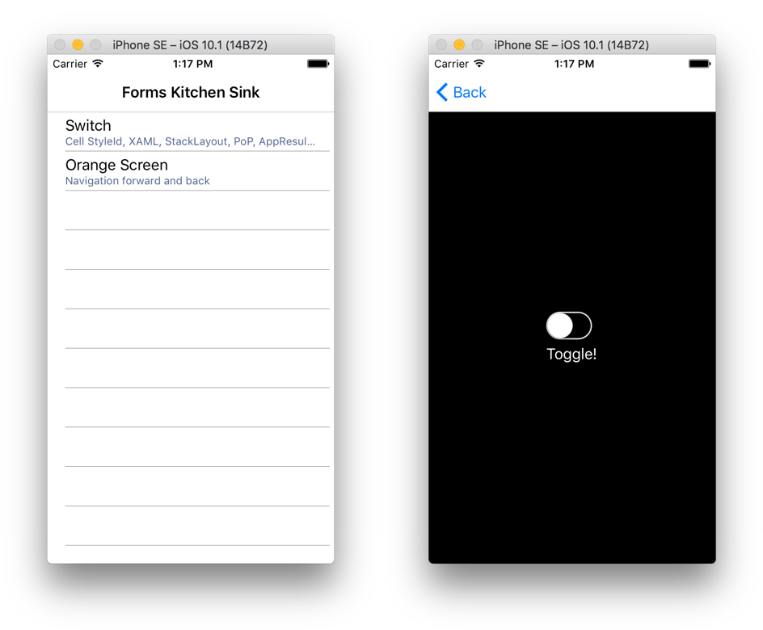
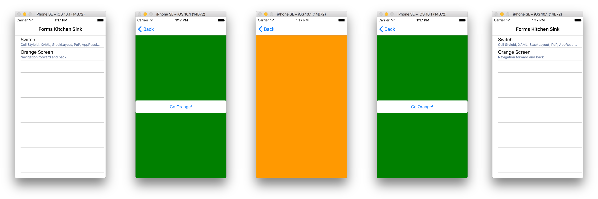

# Overview

The files in this repository provide a high-level overview of one possible implementation of the Page Object Pattern for UI testing with Xamarin.UITest.  The application being tested by this test code is not stored in this repository. 

Note that this code hasn't been tested in a production environment, may contain bugs, and is only intended to demonstrate the general approach for Page Object Pattern testing -- not as a template for production code.

# Basic UI testing

Basic UI tests that haven't been architected according to the Page Object Pattern are simple enough: they query interface elements from the application's UI (for example, find a button), interact with those elements (tap the button), and then use assertions to verify that the app has responded as expected (the button tap caused navigation to occur).

For a basic example of this a test written using this style, look at [NonPageObjectPatternTest](Tests.cs#L54). This simple test:

- Starts up the app
- Taps an item in the list, which navigates to a screen that contains a switch
- Verifies that the switch is off

Here's an image showing the two screens that appear in the app during this test:

# What's wrong with this basic approach to UI testing?

This style of basic UI testing works well when writing tests for extremely simple apps or when the goall is to get initial tests up and running as quickly as possible.

However, there are a few drawbacks:

- Tests are difficult to read when they directly specify interface query logic, especially if those queries are non-trivial; the intent of the test gets lots when the implementation details are front-and-center
- It may be necessary to branch your test code in situations where iOS and Android require different queries to access the same interface element in the app; this also decreases readability and maintainability
- It is easy to fall into the trap of cutting and pasting query code between tests
- It is difficult to share test code between testers, since each test stands on its own and there is no common testing infrastructure

# Page Object Pattern

In Page Object Pattern testing with Xamarin.UITest, each screen in the app is represented by a C# class (the "page object class") in the test suite. When a test method needs to interact with a particular screen in the app, it instantiates the appropriate page object class and uses its methods and properties to manipulate the state of that screen as necessary. The test method need not query the interface directly; it instead relies solely on the page object class to do this work.

For example, the page object class for a login screen might have `EnterUsernameAndPassword(...)` and `TapSubmit()` methods; the page object class for a shopping cart screen might have `AddItem(...)` and `RemoveItem(...)` methods; the page object class for an account page might have `UpdateUserInfo(...)` and `CancelEditing()` methods. The idea is that the page object class cleanly surfaces all the actions and information a user might expect to interact with on a given screen in the app.

Remember: these page object classes are defined in the test suite, not the application code. They merely represent and allow interaction with the screens in the app; these page object classes are not the actual implementation of the app.

The advantages to this approach are many:

- Tests become easier to read because the intent of the test is being expressed in a clean and readable fashion through the page object classes; implementation details are abstracted away
- If iOS and Android require different code paths to access the same interface elements, these divergent code paths are expressed in the page object classes rather than in the test methods; this makes it easier to read and maintain the tests
- There is less temptation to cut and paste queries between tests since these queries are now abstracted as reusable methods and properties on the page object classes
- New testers can immediately leverage the existing page object classes, increasing code reuse and efficiencey

## Examples

To better understand the functionality being tested by the tests in `Tests.cs`, check out the screenshots below.

### `TestSwitchScreen1`

### `TestOrangeScreenWithoutBackdoor`

### `TestOrangeScreenWithBackdoor`

# License

[MIT license](LICENSE.md)
