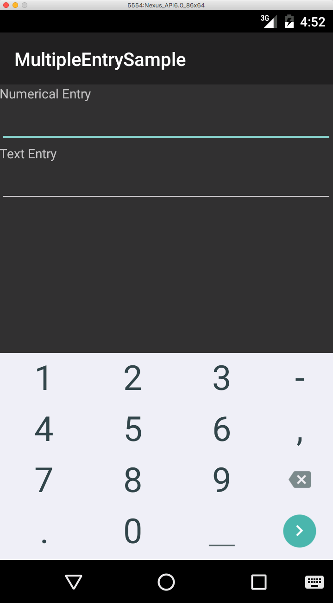
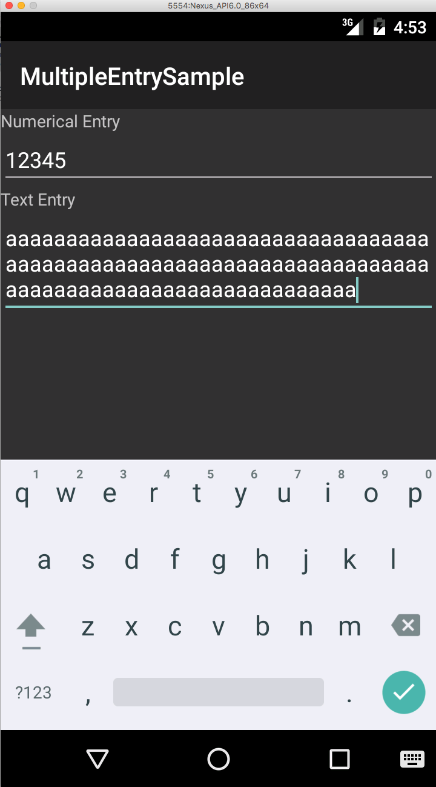


This app demonstrates the different usage of the EditText in Android.

##Numerical EditText with Next Button

The first EditText limits the user input to numerical digits and changes the 'Enter'/'Carriage Return' button on the keyboard to 'Next'.

##Multiline EditText with Done Button

The second EditText shows how to extend the EditText class to create a multiline EditText that displays the 'Done' button on the keyboard instead of the 'Enter'/'Carriage Return'

Authors
-------

Brandon Minnick

Customer Success Engineer
