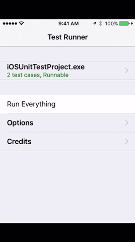

##Xamarin.Forms Unit Test Projects

As we begin to build out our testing suite, unit tests can be created for our ViewModels. This can be done through test runners that display results in an application and that is exactly what this example is doing.

Another option would be bringing an NUnit project into your Forms project and reference the PCL directly to access the ViewModels. You should follow a ViewModelObject pattern if this is the case. This would be identical to a PageObject Testing Suite.

###**Author:**  
**Michael Watson**  
**Customer Success Engineer**  
**Xamarin.Forms Ninja**  