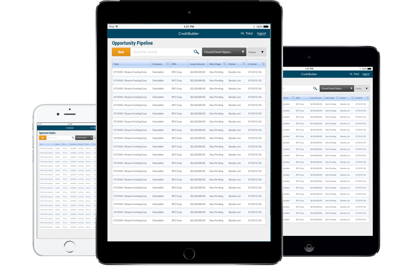

# Investment Sample App
This sample app was made for a customer to demonstrate how to port a Desktop App to a Mobile App. This customer has an existing Desktop application. They provided us a mock up of their mobile app (see below) which did not follow [iOS UI best-practices](https://developer.apple.com/library/ios/documentation/UserExperience/Conceptual/MobileHIG/). We created a sample app to demonstrate how to adhere to mobile UI while still maintaining a workflow familiar to their desktop app.

This app utilizes a SQLite databse, MVVM, along with these Xamarin.Forms controls: Carousel Page, Search Bar, Picker, Grid, StackLayout, Navigation Page, ListView, ViewCell. It also shows how to tweak the UI to best appear on larger tablet screens.

## Original Desktop App Mockup
The customer provided us this wireframe as the initial design for their mobile application. Their goal was to replicate their existing desktop app .

## Sample App on iPad
This is the sample app we provided as it appears on a tablet

## Sample App on iPhone
This is the sample app we provided as it appears on a phone

### Author
Brandon Minnick

Customer Success Engineer
