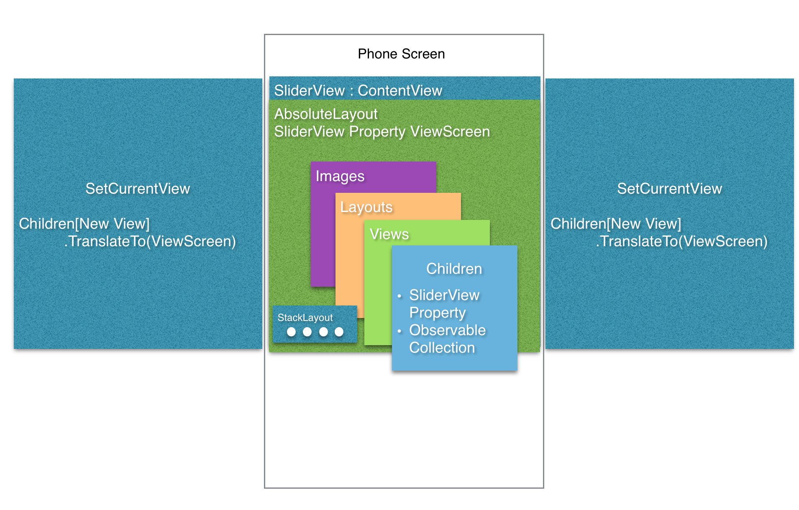

##SliderView - The Amazing Power of Xamarin.Forms

###This is for iOS and Android only. If someone wants to build out the Windows Phone renderers, I will take a look at it and add it.

This is a Xamarin.Forms SliderView that I built over last weekend (5/30). I've heard a lot of the forums about having a CarouselPage, but in a view. I have no doubt that this will come sometime in the future, but this solution hopefully will help someone in their development. 

I came up with an idea to make a canvas, then animate views into the canvas to create a sliding action. I think this is awesome that I can make controls like this in Xamarin.Forms! Below is how I structured SliderView from a 10,000 ft view.

I knew I was going to need to build in gesture recognizers with custom renderers, so I started with a ContentView as my SliderView base. This allows me to utilize a ViewRenderer for my iOS and Android specific code.

The SliderView is mainly composed of a AbsoluteLayout to display the main view on screen, an ObservableCollection of Xamarin.Forms Views, and the DotStack. Below is the list of properties in the SliderView

Properties:  

* ViewScreen
	* AbsoluteLayout and considered the main view of SliderView 
* Children
	* ObservableCollection of Xamarin.Forms Views
* CurrentView
	* Current View (from Children) displayed in the ViewScreen
* DotStack
	* This is a StackLayout that has the little white dots we know sliders have
* TransitionLength
	* You can pass in the milliseconds you want it to take to complete the sliding animation
	
Both iOS and Android custom renderers for the SliderView will implement gesture recognizers to create the swipe animations. The idea is the same for both OS; add and layout views off-screen and then use the TranslateTo property to bring them into the ViewScreen. I added the Dots to give a more native feel, but I never implemented the click gesture recognizers. Maybe one day I will, but if you wanted to....

The white dots are already buttons in the StackLayout. They have click events that you have access to. You just need to implement the view translations on the PCL slide and then also incorporate both the dotCount and currentViewIndex on the PCL side as getter properties so you can access them. I didn't implement them because I personally hate them; they're just too small to be functional on any phone, but enough of that.

##Xamarin.Forms Android Image Memory Management
So I wanted to also take this opportunity to really tackle the issues around Android Image performance with Xamarin.Forms. This seems to be a pain point for most developers, but I'm going to go over how I solved these problems and how the tests I did give me confidence in the SliderView using Xamarin.Forms Images!!!

###Let's talk about Android BitMaps
Android does some crazy things with BitMaps. Making artifacts and crushing our memory for no reason, just because it can't think for itself. What I mean is that Android does scale the images, but very poorly. The proper method is to scale your images prior to loading them into the BitMap. Another option is to provide the pre-scaled images in the correct Resources folders:

* drawable (mdpi)
* drawable-hdpi
* drawable-xxdpi
* drawable-xxhdpi

This prevents those nasty artifacts and memory leaks. This doesn't just happen on Xamarin.Forms Android applications or Xamarin.Android applications, this is *all* Android applications. If you don't believe me, check out the docs.

###So what did I do?
I wrote a test script that will do the following

* Navigate to the SliderView: 
* swipe through all of the views in the SliderView, 
* Navigate back to the main screen
* Navigate to the SliderView
* End Test 

In this test I was looking to see what happened to the memory as I swiped through the Views and then what happened with the memory when I reloaded the SliderView. All memory leaks I have seen with Xamarin.Forms Images is essentially equal to whatever the first image load was. My red flag is to any spikes in the Memory during my Xamarin.Test Cloud Runs.

I ran the same test script under three scenarios with the images. I downloaded the images from the internet and all of them are over 2000x1500 pixels in original size. Never use photos like this and I will show you why.
	
Test Script Scenarios:

1.  Original Images with no scaling
2.  Scale images to have a 1080 pixel width
	* This is a typical size for xxhdpi
3.  Scale images to fit the following widths:  
	* 320 pixels (mdpi)  
	* 480 pixels (hdpi)
	* 720 pixels (xdpi)
	* 1080 pixels (xxdpi)
	
I chose to run them on various Android devices with varying screen sizes and pixel densities. Below are the devices used for this test:

|Devices			   |Android |Version	|Resolution (pixels)	PPI
|---------------------------------------------|
|HTC Desire C		   |4.0.3	|320 x 480	|165|
|Nokia X Dual Sim	   |4.1.2	|480 x 800	|233|
|HTC One S			   |4.1.1	|540 x 960	|256|
|Samsung Galxy Note II|4.3		|720 x 1280	|267|
|Amazon Fire Phone	   |4.2.2	|720 x 1280	|312|
|LG Nexus 4			   |4.4.2	|768 x 1280	|318|
|Samsung Galaxy S4    |4.3		|1080 x 1920|441|
|LG Nexus 5			   |4.4		|1080 x 1920|445|

Below are the results:

From the results of the tests, we can see there were **HUGE** performance differences just from doing a litle bit of work with the image sizes. 7 of the 8 devices crashed while swiping through the SliderView from OutOfMemoryExceptions. After I resized the images to the 1080 pixel width, only the Samsung Galaxy Note II crashed. All of the other devices had problems with their memory. 

Two main take aways from SliderView

	1. The SliderView of course!
	2. Always scale your images prior to loading them on Android devices. 
		* If you won't have local files, make sure your backend is setup to give you the correct size images. 

One Idea it to have your backend scale the image for you. This can be down with System.Drawable.BitMap if your backend is .Net. Another option would be to use [UrlImageViewHelper](http://components.xamarin.com/view/urlimageviewhelper) to load the web images. You would need to create a custom property and a custom renderer to implement this, but it wouldn't be that hard. 		

##Author
Michael Watson
