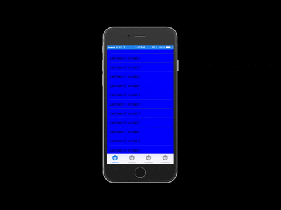
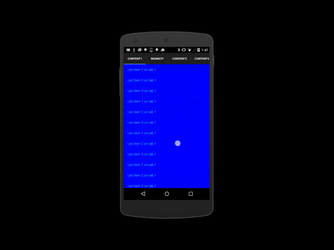

##TabbedRenderer - Adding swipe feature to TabbedPage

This sample modifies Charels Petzold's TabbedPage sample (iOS and Android) to add TabbedRenderers with swipe gesture capabilities. The user is now able to swipe between tabs or tap on the specific tab. 

If you have any questions, feel free to open an issue against this sample and I will respond as soon as I can.

You'll notice that on Android, we need to make sure we are manually firing off the GestureDetector events. We need to do this to ensure the ListView doesn't absorb any of the gestures. As you add controls with Gestures, you will always need to think how the Gesture propagates through the views.

###Author
------

Michael Watson  
Customer Success Engineer  
Xamarin.Forms Specialist  
@ThreeBrewMates  
